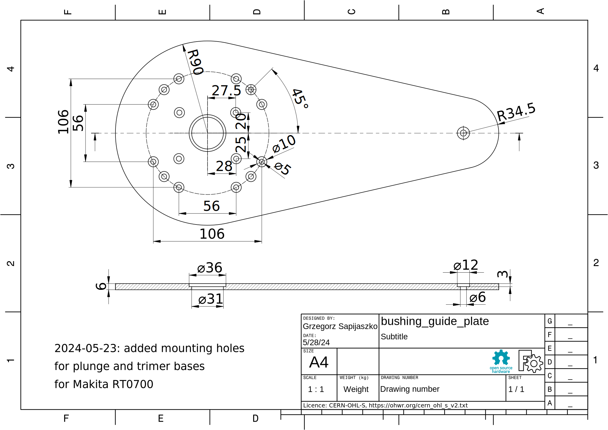
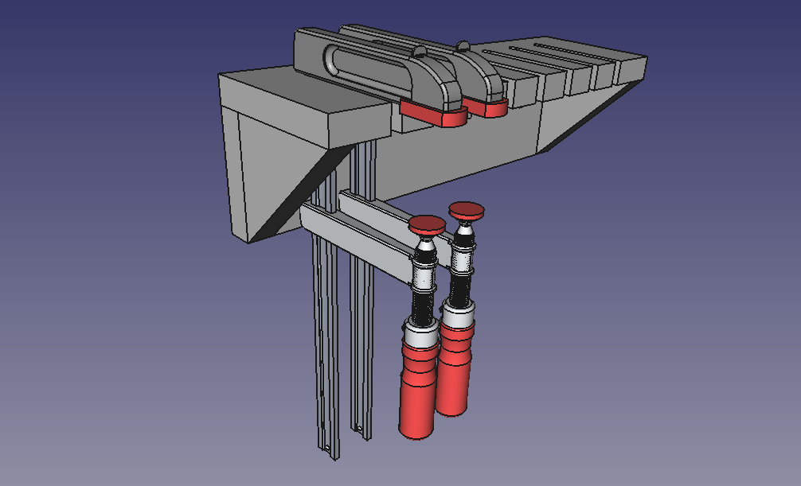

# Woodworking and shop projects

A slowly growing collection of useful thing for woodworking workshop.

The first one, it’s parametric [drill press
table](./drill_press/readme.md), with mobile base and cabinet for Dedra
DED 7807 drill press. However you can modify it for any (bench-top)
drill press. All details were cut on
[`MPCNC`](https://docs.v1e.com/mpcnc/intro/), however you can use table
saw + router. `cnc` directory contain `.gcode` files for Marlin
controller.

### Makita M3600, RT0700 - offset/bushing guide baseplate

Made of 6mm polycarbonate taken from old PC monitor. Central holes
$\phi 31/36$ accommodates bushing guide, the remaining counter bored
holes $\phi 5/10$ allows to mount the Makita M3600 router or plunge and
trimmer bases for RT070x series router.

### Clamps racks

A few racks for 80 and 120 mm bar clamps and 3/4’’ pipe clamps. The
clamp model used in below visualization is made by [Ahmed
ElPrince](https://grabcad.com/library/f-clamp-3).

## Licence

All designs are available under CERN Open Hardware Licence
[OHL-S](https://cern-ohl.web.cern.ch/home). All models/drawings/G-code
were prepared using [FreeCAD](https://www.freecad.org/) or
[OpenSCAD](https://openscad.org/).

<!--
## References
::: {#refs}
:::
-->
