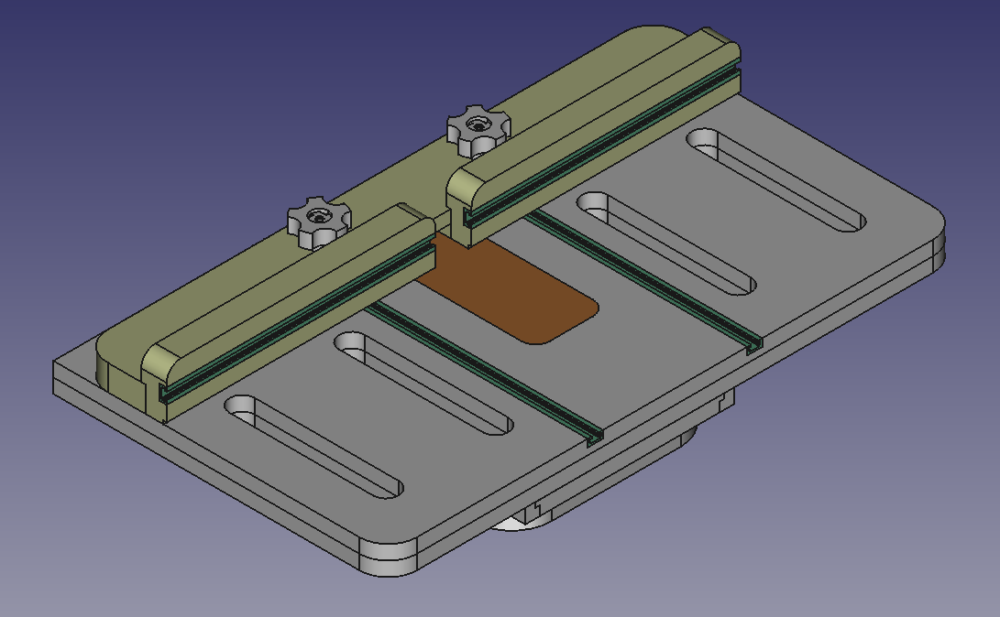
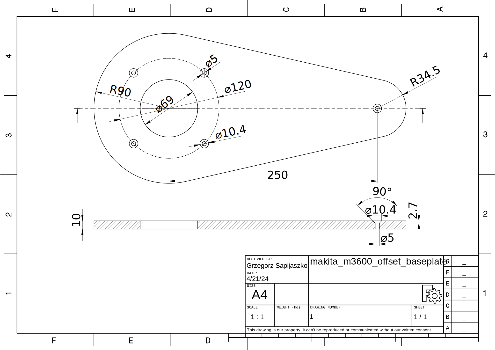

# Woodworking and shop projects

A slowly growing collection of useful thing for woodworking workshop.

The first one, it’s parametric [drill press
table](./drill_press/readme.md), with mobile base and cabinet for Dedra
DED 7807 drill press. However you can modify it for any (bench-top)
drill press. All details were cut on
[`MPCNC`](https://docs.v1e.com/mpcnc/intro/), however you can use table
saw + router. `cnc` directory contain `.gcode` files for Marlin
controller.

### Makita M3600 - offset baseplate

Made of 10mm polycarbone taken from old PC monitor.

## Licence

All designs are available under CERN Open Hardware Licence
[OHL-P](https://ohwr.org/cern_ohl_p_v2.txt). All models/drawings/G-code
were prepared using [FreeCAD](https://www.freecad.org/) or
[OpenSCAD](https://openscad.org/).

<!--
## References
::: {#refs}
:::
-->
